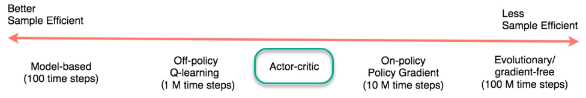

# Training Robotic Arms by Continuous Control using Deep Reinforcement Learning
##### &nbsp;


## Goal
I built a Reinforcement Learning (RL) agent that controls a robotic arm within Unity's [Reacher](https://github.com/Unity-Technologies/ml-agents/blob/master/docs/Learning-Environment-Examples.md#reacher) environment. The goal is to get 20 different robotic arms to maintain contact with the green spheres as long as possible. Therefore, the agent is trained in the Second Version of the environment. In the second version of the project environment, there are 20 identical copies of the agent. It has been shown that having multiple copies of the same agent sharing experience can accelerate learning.

A reward of +0.1 is provided for each timestep that the agent's hand is in the goal location. Thus, the goal of the agent is to maintain that position at the target location for as many time steps as possible in order to maximize its total reward.

The target for the agent is to solve the environment by achieving a score of +30 averaged across all 20 agents for 100 consecutive episodes.

##### &nbsp;
## The Environment
- _**Set-up**_: Double-jointed arm which can move to target locations.
- _**Goal**_: Each agent must move its hand to the goal location, and keep it there.
- _**Agents**_: The environment contains 20 agents linked to a single Brain.
- _**Agent Reward Function (independent)**_:
  - +0.1 for each timestep agent's hand is in goal location.
- _**Brains**_: One Brain with the following observation/action space.
  - Vector Observation space: 33 variables corresponding to position, rotation, velocity, and angular velocities of the two arm Rigidbodies.
  - Vector Action space: (Continuous) Each action is a vector with four numbers, corresponding to torque applicable to two joints. Every entry in the action vector should be a number between -1 and 1.
  - Visual Observations: None.
- _**Reset Parameters**_: Two, corresponding to goal size, and goal movement speed.
- _**Environment Solving Criteria**_: The target for the agent is to solve the environment by achieving a score of +30 averaged across all 20 agents for 100 consecutive episodes.

##### &nbsp;
## The State and Action Spaces

```python
Number of agents: 20
Size of each action: 4
There are 20 agents. Each observes a state with length: 33
The state for the first agent looks like: [  0.00000000e+00  -4.00000000e+00   0.00000000e+00   1.00000000e+00
  -0.00000000e+00  -0.00000000e+00  -4.37113883e-08   0.00000000e+00
   0.00000000e+00   0.00000000e+00   0.00000000e+00   0.00000000e+00
   0.00000000e+00   0.00000000e+00  -1.00000000e+01   0.00000000e+00
   1.00000000e+00  -0.00000000e+00  -0.00000000e+00  -4.37113883e-08
   0.00000000e+00   0.00000000e+00   0.00000000e+00   0.00000000e+00
   0.00000000e+00   0.00000000e+00   5.75471878e+00  -1.00000000e+00
   5.55726624e+00   0.00000000e+00   1.00000000e+00   0.00000000e+00
  -1.68164849e-01]
```
##### &nbsp;


## Reinforcement Learning Methods


[3 Types of Reinforcement Learning are shown below:](https://youtu.be/zR11FLZ-O9M?t=1885)


| Model-Based  | Value-Based | Policy-Based |
| ------------- | ------------- | ------------- |
| Learn the model of the world, then plan using the model |Learn the state or state-action value | Learn the stochastic policy function that maps state to action |
| Update model often | Act by choosing best action in state   | Act by sampling policy |
| Re-plan often  | Exploration is a necessary add-on  | Exploration is baked in |


##### &nbsp;


## Deep Deterministic Policy Gradient (DDPG)
The algorithm implemented to solve this environment is [_Deep Deterministic Policy Gradient_](https://arxiv.org/pdf/1509.02971.pdf). This is _a model-free, off-policy actor-critic algorithm using deep function approximators that can learn policies in high-dimensional, continuous action spaces_. This is an extension of Deep Q-learning specialized for continuous tasks. A [single-agent DDPG implementation](https://github.com/udacity/deep-reinforcement-learning/tree/master/ddpg-pendulum) to solve OpenAI Gym's Pendulum environment is used as a base point to start my implementation.
##### &nbsp;

[_A non-exhaustive, but useful taxonomy of algorithms in modern RL_](https://spinningup.openai.com/en/latest/spinningup/rl_intro2.html#a-taxonomy-of-rl-algorithms)
##### &nbsp;

### Gradient Ascent

DDPG learns directly from the observation spaces through policy gradient method which estimates the weights of an optimal policy via gradient ascent which is similar to gradient descent in neural nets. The policy based methods are also robust in continuous action-space environments.


[Gradient ascent](https://youtu.be/5E86a0OyVyI?t=137) is similar to gradient descent.

- Gradient descent steps in the direction opposite the gradient, since it wants to minimize a function.
- Gradient ascent is otherwise identical, except we step in the direction of the gradient, to reach the maximum.
##### &nbsp;


##### &nbsp;

### Actor-Critic Method

DDPG is an actor-critic algorithm. Critic model learns the value-function and uses it to change/improve Actor's policy-based model. The Actor brings the advantage of learning in continuous action spaces without the need for extra optimization procedures which is required in a value-based function while the Critic supplies the Actor with knowledge of the performance.




```python
# Actor Network (w/ Target Network)
self.actor_local = Actor(state_size, action_size, random_seed).to(device)
self.actor_target = Actor(state_size, action_size, random_seed).to(device)
self.actor_optimizer = optim.Adam(self.actor_local.parameters(), lr=LR_ACTOR)

# Critic Network (w/ Target Network)
self.critic_local = Critic(state_size, action_size, random_seed).to(device)
self.critic_target = Critic(state_size, action_size, random_seed).to(device)
self.critic_optimizer = optim.Adam(self.critic_local.parameters(), lr=LR_CRITIC, weight_decay=WEIGHT_DECAY)
```
##### &nbsp;

[_How Actor-Critic works_](https://medium.freecodecamp.org/an-intro-to-advantage-actor-critic-methods-lets-play-sonic-the-hedgehog-86d6240171d)


##### &nbsp;


### Exploration vs Exploitation Dilemma
Exploration vs Exploitation concept that is usually managed by epsilon greedy policies  (with some probability epsilon `𝛜`) are no longer valid for the environments like controlling a robotic arm. The actions driving the movement of the arm are forces with different magnitudes and directions.

If the _exploration_ mechanism is conducted with random uniform sampling, the direction actions would have a mean of zero, in turn cancelling each other out. This would lead an oscillation in the system with no or little progress.

To conduct _Exploration vs Exploitation_ concept, we'll use the **Ornstein-Uhlenbeck process**, as suggested in the previously mentioned [paper](https://arxiv.org/pdf/1509.02971.pdf). The Ornstein-Uhlenbeck process adds a certain amount of noise to the action values at each timestep. This noise is correlated to previous noise, and therefore tends to stay in the same direction for longer durations without canceling itself out. This allows the arm to maintain velocity and explore the action space with more continuity.


The Ornstein-Uhlenbeck process is implemented in the `OUNoise` class in `ddpg_agent.py` of the source code.

The table below shows Ornstein-Uhlenbeck process hyperparameters;

| Parameter  | Description | Value |
| ------------- | ------------- | ------------- |
| `mu` | The long-running mean | 0 |
| `theta` | The speed of mean reversion | 0.15 |
| `sigma` | The volatility parameter | 0.2 |

Decay in noise parameter as the agent gains more experience is not applied in the last version of this implementation since no potential benefit observed in the trials.


##### &nbsp;


### Other Methods & Unstable Learning Challanges
Along with the Actor-Critic model followings are applied to overcome the unstable learning challanges (also faced in DQN algorithm);

- _**Gradient Clipping**_: Gradient clipping is implemented using the `torch.nn.utils.clip_grad_norm_` function. This helps _clip_ the norm of the gradients at 1, therefore placing an upper limit on the size of the parameter updates, and preventing them from growing exponentially. Note that this function is applied after the backward pass, but before the optimization step.

- _**Experience Replay Using Memory Buffer**_: _Experience replay allows the RL agent to learn from past experience. Memory buffer contains a collection of experience tuples with the state, action, reward, and next state `(s, a, r, s')`. Each agent randomly samples from this buffer as part of the learning step. Therefore, correlations between sequential experience tuples are mitigated._

- _**Batch Normalization**_: _Similar to the exploding gradient issue mentioned above, running computations on large input values and model parameters can inhibit learning. Batch normalization addresses this problem by scaling the features to be within the same range throughout the model and across different environments and units. In additional to normalizing each dimension to have unit mean and variance, the range of values is often much smaller, typically between 0 and 1._

- _**Learning Interval Steps**_: _As part of each learning step (20), the algorithm samples experiences from the buffer and runs the Agent.learn() method 10 times._

- _**Soft Target update**_

- _**Twin local/target networks for Actor and Critic**_

##### &nbsp;


## Model Architecture

Following is the Neural Network architecture;

```python
Actor(
  (fc1): Linear(in_features=33, out_features=400, bias=True)
  (bn1): BatchNorm1d(400, eps=1e-05, momentum=0.1, affine=True, track_running_stats=True)
  (fc2): Linear(in_features=400, out_features=300, bias=True)
  (fc3): Linear(in_features=300, out_features=4, bias=True)
)

Critic(
  (fcs1): Linear(in_features=33, out_features=400, bias=True)
  (bn1): BatchNorm1d(400, eps=1e-05, momentum=0.1, affine=True, track_running_stats=True)
  (fc2): Linear(in_features=404, out_features=300, bias=True)
  (fc3): Linear(in_features=300, out_features=1, bias=True)
)
```
##### &nbsp;
## Hyperparameters

| Parameter  | Description | Value |
| ------------- | ------------- | ------------- |
| `GAMMA` | Discount factor | 0.99 |
| `TAU` | Soft update of target parameters | 1e-3 |
| `LR_ACTOR` | Learning rate for the actor | 1e-3 |
| `LR_CRITIC` | Learning rate for the critic | 1e-0 |
| `WEIGHT_DECAY` | L2 Weight decay | 0.0000 |
| `BATCH_SIZE` | Minibatch size | 128 |
| `BUFFER_SIZE` | Size for memory buffer | int(1e6) |
| `LEARN_EVERY` | Learning timestep interval | 20 |
| `LEARN_NUM` | Number of learning passes | 0.99 |

##### &nbsp;
## Results


The agent was able to solve the 20 agent Reacher environment. The goal for the performance measure is an average reward of at least +30 over 100 episodes, and over all 20 agents.

The graph below shows the final results.


##### &nbsp;

## Future Improvements
- _**Prioritized Experience Replay**_: Prioritized replay selects experiences based on a priority value that is correlated with the magnitude of error. This can improve learning by increasing the probability that rare and important experience vectors are sampled. Check out [Prioritized Experience Replay](https://arxiv.org/pdf/1511.05952.pdf) paper by DeepMind. Utilizing this technique helps reduce the training time, improve the stability of the training process and is less prone to the change in hyperparameters.

- _**Experiment with other algorithms**_: Fine tuning the DDPG algorithm required a lot of trial and error and so more time is needed. Perhaps another algorithms as [Trust Region Policy Optimization (TRPO)](https://arxiv.org/abs/1502.05477), [Proximal Policy Optimization (PPO)](Proximal Policy Optimization Algorithms), or [Distributed Distributional Deterministic Policy Gradients (D4PG)](https://arxiv.org/abs/1804.08617) would be more robust.
